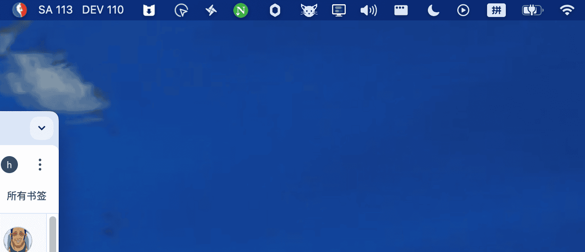
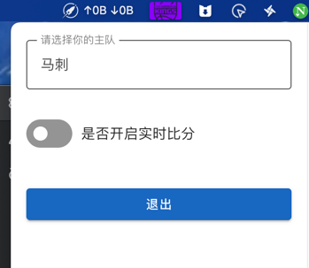
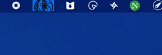

# 预览图






> 如果不关注比分，可以取消，他会是一个定时器，每隔10秒会切换一个球队动画




# 构建图标
```shell
npm run electron:generate-icons
```

# 运行
```shell
npm run start
```

# 打包
```shell
npm run make
```


# 发布
```shell
git tag v1.0.6
git push origin v1.0.6
```